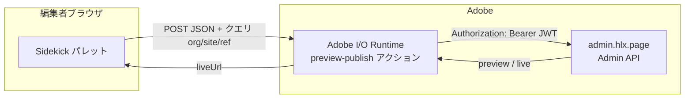

# Preview & Publish（Sidekick × App Builder / Adobe I/O Runtime）

本ドキュメントは、AEM Edge Delivery の **Sidekick** から **プレビュー更新 → 公開（live）** までを実行する機能の、**サイト側（本リポジトリ）** と **App Builder（Adobe I/O Runtime）側** の実装をまとめたものです。

## 概要

| 役割 | 説明 |
|------|------|
| **Sidekick パレット** | 編集者が Web path を指定し「プレビューして公開」を実行する UI（`tools/sidekick/`）。 |
| **オーケストレーター（Runtime アクション）** | ブラウザに Admin API 用トークンを持たせず、[AEM Live Admin API](https://www.aem.live/docs/admin.html)（`admin.hlx.page`）へ **サーバー側** で `preview` → `live` を呼び出す。 |

**オーケストレーター URL** は `tools/sidekick/config.json` のプラグイン `url` クエリ `orchestrator=` で指定します（App Builder デプロイ後の `.../preview-publish.json` の Web アクション URL）。



## Edge Delivery（本リポジトリ / SCP）側

### 配置

| パス | 内容 |
|------|------|
| `tools/sidekick/config.json` | Sidekick プラグイン定義（Preview & Publish のパレット URL・`orchestrator` 付与）。 |
| `tools/sidekick/preview-publish.html` | パレット用 HTML（入力・ボタン・ログ領域）。 |
| `tools/sidekick/preview-publish.css` | パレットのスタイル。 |
| `tools/sidekick/preview-publish-palette.js` | パレットのロジック（`type="module"`）。 |

### 動作の要点

1. **`orchestrator` クエリが付いている場合**（推奨）  
   - `ensureJsonWebActionUrl()` で Web アクション URL に **`.json` 拡張子**を付与（拡張子なしだとゲートウェイの挙動が異なることがある）。  
   - `org` / `site` / `ref` をクエリにも載せ、POST 本文と併用（Runtime が JSON を params に載せない場合のフォールバック）。  
   - 応答が `{ statusCode, headers, body: "<JSON文字列>" }` の形式でも、`body` をパースして `liveUrl` / `error` を解釈する。

2. **`orchestrator` が無い場合**（フォールバック）  
   - ブラウザから直接 `admin.hlx.page` を呼ぶ（Cookie ベースの認証が前提）。運用では **オーケストレーター利用を推奨**。

3. **プロジェクト解決**  
   - Sidekick の `passConfig` で渡る `ref` / `repo` / `owner`、および `host` または **パレット iframe の `hostname`**（`{ref}--{repo}--{owner}.aem.page` 形式）から `owner`・`repo` を補完。

4. **編集元 URL（referrer）**  
   - `passReferrer: true` により、ルート `/` や `/index` のとき **編集元ページ URL** から `webPath` を Admin API の `status` で解決する。

### Sidekick 設定の例

`config.json` 内の `url` は、実際の App Builder ステージ URL に合わせてください（以下は例）。

```text
/tools/sidekick/preview-publish.html?orchestrator=https%3A%2F%2F<namespace>-<app>-stage.adobeio-static.net%2Fapi%2Fv1%2Fweb%2F<package>%2Fpreview-publish.json
```

---

## App Builder（Adobe I/O）側

App Builder プロジェクトは、本サイトリポジトリと **別ディレクトリ** で管理している想定です（例: 同じ親フォルダ配下の `aio/singleactionpublish`）。

### 配置

| パス（App Builder プロジェクト内） | 内容 |
|-----------------------------------|------|
| `app.config.yaml` | Runtime マニフェスト（パッケージ名、アクション、`inputs` の環境変数マッピング）。 |
| `actions/ping/index.js` | 疎通・デプロイ確認用の最小 Web アクション。 |
| `actions/preview-publish/index.js` | **プレビュー → 公開**の本体（Admin API 呼び出し）。 |
| `.env` | **コミット禁止**。ローカルデプロイ時のシークレット（`.gitignore` 対象）。 |
| `.env.example` | 必要な変数名のテンプレート。 |
| `scripts/diagnose-web-action.sh` | `curl` → `x-openwhisk-activation-id` → `aio rt activation get` による切り分け（任意）。 |

### `app.config.yaml` の要点

- **`preview-publish`** に `inputs` で次をバインド（`$VAR` は `.env` や CI の環境変数から展開）:
  - `ADMIN_API_AUTH_HEADER` … Admin API 用（`Bearer <JWT>` 形式を推奨）
  - `ORCHESTRATOR_SECRET` … 任意。設定時は呼び出し側が `X-Orchestrator-Secret` または JSON `secret` で一致させる必要あり
- **`exports.main = main` のみ**でエクスポート（`module.exports` と併記しない）。Webpack バンドル後も **二重初期化**（`Cannot initialize the action more than once.`）を避けるため。

### Web アクションの応答形式

OpenWhisk / adobeio-static 経由の互換性のため、成功・失敗とも **HTTP 応答相当**の形で返します。

- `statusCode`（数値）
- `headers['Content-Type']`（`application/json`）
- `body` … **JSON オブジェクトを `JSON.stringify` した文字列**（例: `{"liveUrl":"..."}` / `{"error":"..."}`）

### 環境変数とデプロイ

1. `.env.example` をコピーして `.env` を作成し、`ADMIN_API_AUTH_HEADER` 等を設定する。  
2. プロジェクトルートで **`aio app deploy`** を実行する。  
3. 反映確認:  
   ```bash
   aio rt action get singleactionpublish/preview-publish
   ```  
   `parameters` に `ADMIN_API_AUTH_HEADER` 等の **キー** があればバインド済み（値は暗号化表示で正常）。

### トラブルシューティング（Runtime）

| 現象 | 確認 |
|------|------|
| ブラウザが `500` / 汎用エラー | `curl` のレスポンスに `x-openwhisk-activation-id` があれば **`aio rt activation get <id>`** で真因（`response.result`）を確認。 |
| `ADMIN_API_AUTH_HEADER is not configured` | デプロイ時に `.env` が読まれていない、または `inputs` に未マッピング。 |
| `Response is not valid 'application/json'`（表向き） | アプリケーションエラーが別メッセージにラップされることがある。**activation** を必ず確認。 |

---

## セキュリティ

- **Admin API 用 JWT** は **Runtime のアクション既定パラメータ（暗号化）** にのみ保持し、フロントのリポジトリや Sidekick 設定に **平文で置かない**。

---

## 参考リンク

- [AEM Live — Admin API](https://www.aem.live/docs/admin.html)
- [Adobe — Creating Actions（Web アクション）](https://developer.adobe.com/runtime/docs/guides/using/creating_actions/)
- [Apache OpenWhisk — Web Actions](https://github.com/apache/openwhisk/blob/master/docs/webactions.md)
